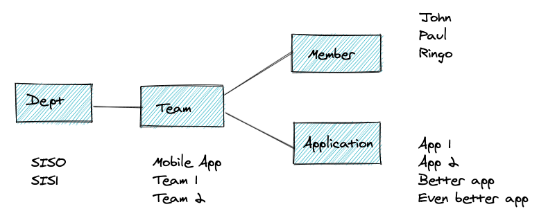
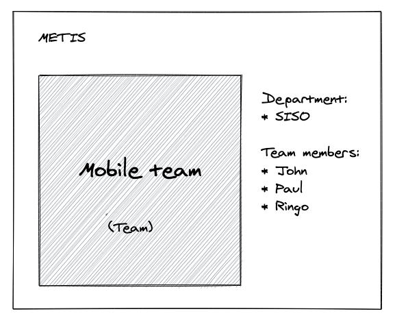

# Metis   [](https://github.com/psf/black)

Metis is a [graph](https://en.wikipedia.org/wiki/Graph_(discrete_mathematics)) of people that can be navigated with a web browser. It lets you navigate through a structure of people, how they are organized, what they work with, their interests, and so on.

Consider a structure where there are departments, teams, teams members and applications:



Metis provides a way to visualize and navigate through this graph. From the start, the user interface will look something like this:


Highlights:
* One selected node in focus (to the left)
* Other nodes associated with this node are shown to the right (grouped by type).
* Clicking on any of the nodes to the right will select that node, i.e. putting that node in focus (and showing the nodes that are associated with it).
* It should also be possible to visualize the compete graph, but maybe not as part of the MVP.

## Product vision/goal

This product actually has a potential for exposing the (maybe informal and ever-changing) structure of teams, people and projects. It should acquire data where available, and have a decentralized way for data updates.

There are many types of nodes that can be added to such a graph. Some ideas are:
* Persons can be linked to location, interests, ...
* Projects can be linked to backlog, task board, GitHub repo, ...

## MVP
* Hard-coded data structure (JSON?), no database.
* No connection to other systems (AD, ...)
* UI as outlined above

## How we work
To know more about how we work you can read [here](how_we_work.md).

# SI Gathering Challenge: Template

To run the project locally, you need docker:

```
docker build -t <name> .
docker run -p 8000:8000 <name>
```
